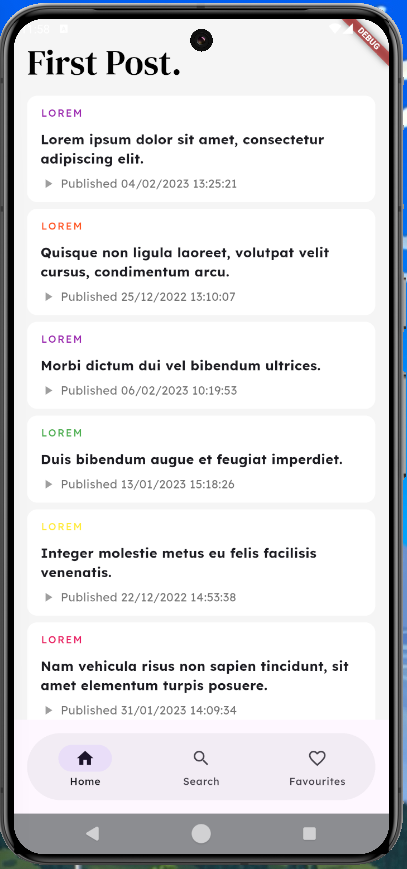
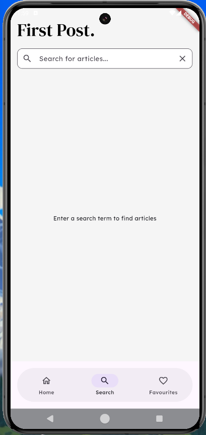

# Flutter Article App

A modern Flutter application that fetches and displays articles from a remote API. The app supports viewing articles in different categories, searching by keywords, and saving favorites for offline viewing.

## Features

- **Article Listings**: Browse through a curated list of articles 
- **Search Functionality**: Search for specific articles using keywords
- **Detail View**: View complete article content with images
- **Favorites**: Save articles for offline viewing
- **Responsive UI**: Clean and modern UI that works across different device sizes
- **Optional**: Pull to refresh on both home and favourites page

## Screenshots


<br><br>


<br><br>


<br><br>

## Setup Instructions

1. Clone the repository:
```bash
git clone https://github.com/mayurnile/articles_app.git
cd articles_app
```

2. Create a `.env` folder with a `.dev_env` file containing your API base URL:
```
BASE_URL=https://jsonplaceholder.org/
```
Currrently I'm commiting the .env file for ease of accessing the project I won't do that in production environment :)

3. Install dependencies & Run build runner:
```bash
flutter pub get
dart run build_runner build
```

4. Run the app:
```bash
flutter run
```

## Tech Stack

- **Flutter Version**: ^3.29.2
- **State Management**: Bloc/Cubit (flutter_bloc: ^9.1.0)
- **Dependency Injection**: GetIt (^7.7.0)
- **HTTP Client**: Dio (^5.8.0+1)
- **Local Storage**: Hive (^2.2.3)
- **Navigation**: Auto Route (^9.2.2)
- **Functional Programming**: Dartz (^0.10.1)
- **Environment Config**: flutter_dotenv (^5.2.1)

## Architecture

The application follows a clean architecture approach:

- **Presentation Layer**: Contains UI components, screens, and Bloc classes
- **Domain Layer**: Contains business logic and repository interfaces
- **Data Layer**: Implements repositories and data sources (remote and local)

## State Management Explanation

The app uses the BLoC (Business Logic Component) pattern for state management, which provides a clean separation between UI and business logic. Each feature has its own Bloc that handles events and emits states. This allows for a unidirectional data flow, making the app more predictable and easier to debug.

The Bloc pattern is particularly useful for this app because it manages complex state transitions between loading data, displaying articles, handling search functionality, and managing favorites.

## Known Limitations

- Currently, offline functionality is limited to saved favorites
- Search is performed on the client side rather than server side
- Limited error handling for API failures
